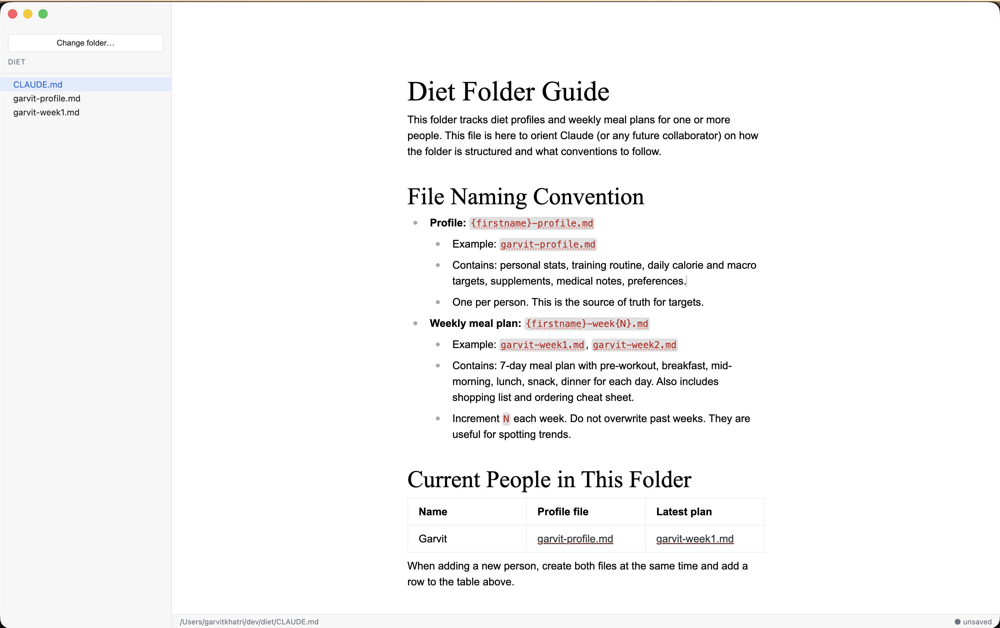

<p align="center">
  
</p>

# pagr

A tiny, opinionated markdown viewer and editor for folders that Claude wrote.



## Install

Builds aren't signed with an Apple Developer certificate yet, so the
first-run involves one extra step. This is a three-command dance; you
only need to do it once per install.

1. **Download** the latest `.dmg` from the
   [Releases page](https://github.com/plusminushalf/pagr/releases).
2. **Install** by double-clicking the DMG and dragging **pagr** to
   your Applications folder.
3. **Strip the macOS quarantine attribute** so Gatekeeper lets the
   unsigned app launch:

   ```sh
   xattr -cr /Applications/pagr.app
   ```

4. **Open** pagr from Applications.

If you skip step 3, macOS will refuse to open the app with
*"pagr is damaged and can't be opened"*. That's Gatekeeper rejecting an
unsigned, quarantined app. The `xattr` command removes the download
quarantine flag; after that, the app launches normally.

## Why this exists

Two things Claude Cowork is genuinely good at:

1. Working inside a folder of files.
2. Writing and editing markdown.

Those overlap nicely, and it turns out you can use Claude for a lot of
personal-life stuff that isn't code. The example that pushed me to build
pagr: a personal weekly diet manager.

It's a folder. `profile.md` holds my body stats, training schedule, eating
preferences, and targets. Then `week-01.md`, `week-02.md`, and so on — one
file per week with the plan. Claude Cowork writes and edits these files
for me. That part works great.

The problem is viewing them.

- **In Claude itself**: it's built to chat about files, not to be the place
  you sit down and read them.
- **In VS Code**: slightly better, but VS Code is a code editor first. Raw
  markdown by default, a file tree tuned for projects, and nothing about
  the interface says "here's your plan for the week, read it."

I wanted something in between: open a folder, click a file, read the
rendered plan. When I spot something to tweak, click that line, fix it,
move on. That's pagr.

## The workflow

```
diet/
├── profile.md
├── week-01.md
├── week-02.md
└── assets/
    └── meal-reference.png
```

1. Shape the files with Claude Cowork.
2. When it's time to actually follow the plan — "what am I eating today?"
   — open pagr, pick the folder, click the week, read.
3. Need to change a line? Click it, edit inline, ⌘S, done.

## Not for you if

- You want a general markdown editor. Use Obsidian, iA Writer, or Typora.
- You want plugins, wikilinks, graph view, daily notes. pagr is
  deliberately tiny.
- You want a code editor with good markdown support. Use VS Code.

pagr is for one narrow case: a folder of markdown files that get drafted
by an AI, reviewed by you, and lightly edited over time. If that's not
your workflow, the other apps will serve you better.

## Stack

- Electron + Vite + TypeScript (via Electron Forge)
- React for the shell (sidebar, file tree, layout)
- [Milkdown Crepe](https://milkdown.dev) for the editor — this is what
  gives you the "click a line, edit as raw markdown, click away, it
  re-renders" behavior out of the box

macOS is the only supported platform for now.

## Running locally

```sh
npm install
npm start
```

Requires Node 20+.

